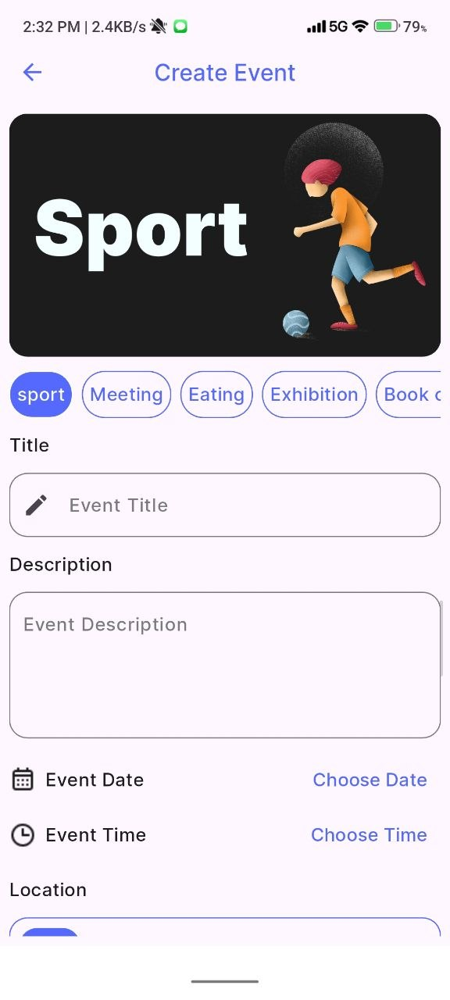

# 🗓️ Evently - Event Planning App

A Flutter-based Event Planning application that helps users create and manage their events, built with Firebase, Provider state management, and a clean modern UI.

---

## 📸 Screenshots

<p float="left">
  
  
  
  
</p>

---

## ✨ Features

- 🔐 User Authentication (Login, Register & Google Sign-In)
- 🏠 Home Screen with Event Categories (Sport, Meeting, Eating, Exhibition...)
- ➕ Create Events with Title, Description, Date, Time & Location
- ❤️ Favorites / Wishlist for saved events
- 🗺️ Map integration
- 🌙 Light & Dark Theme support
- 🌍 Localization (Arabic & English)

---

## 🏗️ Tech Stack

| Layer | Technology |
|---|---|
| Language | Dart |
| Framework | Flutter |
| State Management | Provider |
| Architecture | MVVM |
| Backend | Firebase Firestore |
| Authentication | Firebase Auth & Google Sign-In |
| Localization | Arabic & English |
| Theme | Light & Dark |

---

## 🗂️ Project Structure

```
lib/
├── core/           # Shared utilities, constants, theme
├── features/
│   ├── auth/       # Login & Register
│   ├── home/       # Home screen & categories
│   ├── events/     # Create & manage events
│   ├── favorites/  # Saved events
│   └── profile/    # User profile & settings
```

---

## 🚀 Getting Started

### Prerequisites
- Flutter SDK >= 3.0.0
- Dart SDK >= 3.0.0
- Firebase project setup

### Installation

```bash
# Clone the repo
git clone https://github.com/shriefkoush/event_planning.git

# Install dependencies
flutter pub get

# Run the app
flutter run
```

---

## 📦 Dependencies

```yaml
provider: ^6.x
firebase_core: ^2.x
firebase_auth: ^4.x
cloud_firestore: ^4.x
google_sign_in: ^6.x
```

---

## 👨‍💻 Author

**Shrief Hassan** — Flutter Developer

[](https://www.linkedin.com/in/shrief-hassan-95884a22a)
[](https://github.com/shriefkoush)
